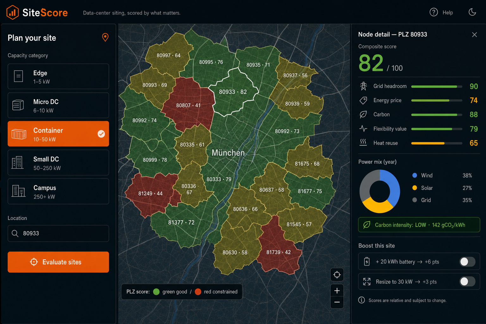
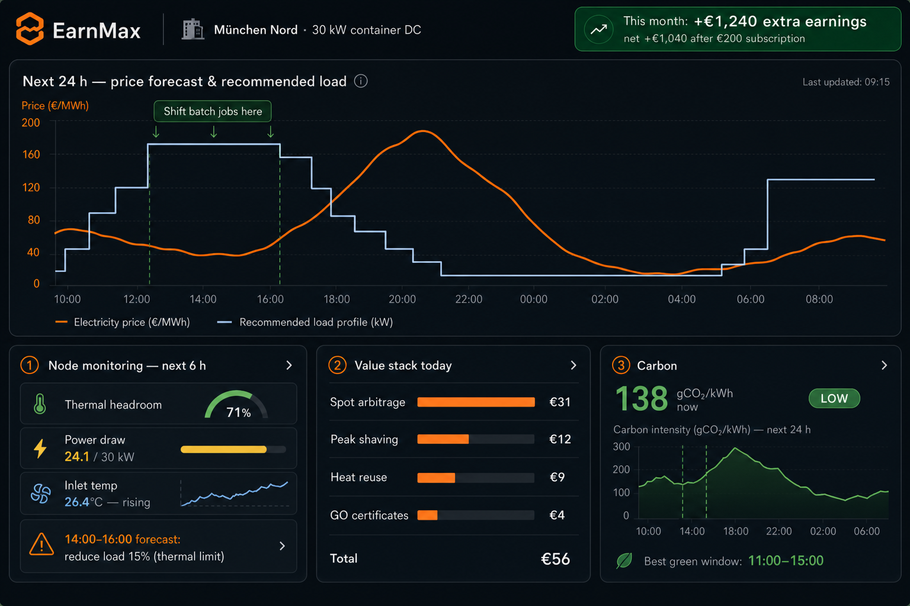

# Project Context — MicroDC Hub

**MicroDC Hub** · SiteScore + EarnMax · Invertix Challenge · Data-Center Siting & Power.

Platform for distributed micro data centers. This document captures the full problem, solution, and pitch narrative from the presentation deck (`index.html`).

---

## 1. Title

**MicroDC Hub** — SiteScore + EarnMax

Distributed data centers, **sited right** and **operated as a grid asset**.

- One-time siting decision report · Yearly operations co-pilot subscription
- Data sources: PyPSA-Eur · Ember · OpenStreetMap · IEA Energy & AI · SMARD · MaStR

---

## 2. The Problem

**AI demand is exploding. Electricity is the binding constraint.**

### Sub-problems

1. **Grid & production bottleneck** — Central data centers wait years for grid connections. Many regions are effectively closed to new large loads.
2. **Clean power value is lost** — Renewables get curtailed; green-certificate and carbon-reporting value goes unexploited because load sits in the wrong place at the wrong time.
3. **Flexibility mismatch** — Central DCs run flat 24/7. The grid increasingly pays for flexible load — and compute is the most shiftable load there is.

### The opportunity

Distributed micro/small data centers (1 kW – 250+ kW) can be built **inside grid-restricted areas**, next to surplus renewables and heat demand — if owners and prosumers know **where to build** and **how to operate**.

---

## 3. Our Angle

**Compute that follows power — not power that chases compute.**

- **Siting:** a constrained grid is not a wall, it's a map. Score every node by what actually drives value.
- **Operation:** a batchable compute load is a **grid asset**. It earns money by being flexible, it doesn't just save money.
- **Heat:** for micro DCs on prosumer premises, reused waste heat can nearly double the value of every kWh.

**Terminology:** we use **carbon intensity & certificate value** (gCO₂/kWh, GOs, CSRD reporting) — not "carbon credits", which consuming green power does not generate in the EU.

### Flexibility value stack (per node)

| Layer | Mechanism |
|---|---|
| Spot arbitrage | Shift batch compute to cheap day-ahead/intraday hours |
| Peak shaving | Reduced grid fees (e.g. §19 StromNEV atypical usage) |
| Heat reuse | Sell/self-consume waste heat on premises |
| Green value | GO certificates + low-carbon SLA for compute customers |

### Hardware proof — NVIDIA × SPAN

The physical layer already exists. **NVIDIA's In-Home Mini Data Center** (16 GPUs, AMD EPYC, high-density RAM) runs AI inference from a compact rack sized for residential/commercial premises. **SPAN** (NVIDIA-backed smart panel) routes **unused household electricity** to the unit — turning surplus home power into compute instead of waste.

**MicroDC Hub is the software layer on top:** SiteScore decides *where* to deploy this hardware (PLZ-level scoring); EarnMax decides *how* to run it profitably (24h forecast, load shifting, extra earnings in euros). Hardware proves feasibility; MicroDC Hub enables scale.

Pitch visual: `assets/video/07-nvidia-span-hardware.png`

---

## 4. The Solution

**Two packages: decide once, earn forever.**

### Package 1 · SiteScore (one-time)

**"Where and what should I build?"**

- Input: capacity category (Edge 1–5 kW → Campus 250+ kW) and/or postal code (PLZ)
- Map of scored **postal-code areas** (~8,200 PLZ in DE): composite score + 5 explainable subscores
- Yearly power mix per node (wind / solar / grid)
- Carbon intensity badge (low / mid / high, gCO₂/kWh)
- Status-quo evaluation + **boost proposals**: add battery, resize, relocate → score delta

### Package 2 · EarnMax (yearly subscription)

**"How do I run it for maximum value?"**

- 24 h energy & price forecast → **recommended operation profile** (10–30% lower energy cost for shiftable load)
- Earnings dashboard: € **extra** earned + saved vs. unmanaged operation (arbitrage, peak shaving, heat, certificates)
- Node monitoring next 3–6 h: thermal headroom, power safety limits, alerts (recommendations, not actuation)
- Carbon-aware scheduling windows for green-SLA workloads

#### Extra earnings vs. running it yourself — 30 kW container DC

| Line | Amount |
|---|---|
| Without EarnMax (flat profile, standard tariff) | baseline |
| + Spot shifting €7,900 · peak shaving €2,100 · heat reuse €4,000 · certificates €500 | +€14,500/yr |
| − EarnMax subscription | −€2,400/yr |
| **Net extra in the operator's pocket** | **+€12,100/yr (~6×)** |

**Business model:** SiteScore funds customer acquisition (paid report); EarnMax is the recurring revenue. Every SiteScore customer is an EarnMax lead.

---

## 5. Package 1 · SiteScore — UI mock



- **Input:** capacity category pills + postal code (PLZ)
- **Map:** green/red PLZ polygons, one node per postal-code area — fine enough resolution for micro-DC siting
- **Node detail:** composite 82/100 + subscores (grid headroom, price, carbon, flexibility, heat reuse)
- **Power mix donut** and carbon-intensity badge
- **"Boost this site":** toggle a 20 kWh battery → +6 pts, live re-score

The boost toggles are the demo moment: trade-offs become visible and actionable.

---

## 6. Package 2 · EarnMax — UI mock



- **Forecast chart:** 24 h price forecast with recommended load profile overlaid ("shift batch jobs here")
- **Monitoring next 6 h:** thermal headroom, power draw vs. safety limit, predictive alert
- **Value stack today:** € per layer — headline is **€ earned + € saved** (10–30% on energy cost via load shifting)
- **Carbon now** + best green window

**The customer math:** the €1,240/month shown is *extra* earnings vs. running the same node without EarnMax. Minus the €200/month subscription → **net +€1,040/month on top of his normal business** — the dashboard proves it daily.

Recommendations, not actuation — honest scope for a 5-hour build, extensible to control later.

---

## 7. How a node is scored

**One number to decide, five numbers to explain.**

| Subscore | Weight | Source |
|---|---|---|
| Grid headroom | 30% | Congestion / spare connection capacity (PyPSA-Eur network data) |
| Energy price | 25% | Expected procurement cost from zonal prices + local generation profile |
| Carbon | 20% | Yearly average + marginal gCO₂/kWh from local power mix (Ember) |
| Flexibility value | 15% | Daily price spread → arbitrage potential for shiftable compute |
| Heat reuse | 10% | Heat-demand proximity from OSM (pools, large buildings, greenhouses) |

**Boost simulation:** battery add-on raises grid-headroom & flexibility subscores; resizing moves the node into a different connection class. Same formula, new inputs → transparent score delta.

Weights are config, not code — tunable live during the demo. Categories (Edge / Micro / Container / Small / Campus) set defaults; the score itself is continuous.

---

## 8. Architecture

**Thin live stack, heavy lifting precomputed.**

```
Offline pipeline (Python, runs once)
  PyPSA-Eur · Ember · SMARD · MaStR · OSM
    → ETL + scoring notebook
    → plz_nodes.geojson (PLZ polygons: subscores, mix, carbon)
    → profiles.parquet (hourly price / wind / solar)

Backend · FastAPI
  GET /nodes?kw=&plz=          ← plz_nodes.geojson
  GET /forecast/:plz           ← profiles.parquet + heuristic optimizer
  GET /monitor/:plz            ← synthetic telemetry generator

Frontend · React + Vite
  MapLibre map + node panel (SiteScore)  ← /nodes
  Recharts dashboard (EarnMax)           ← /forecast, /monitor
  Boost toggles: re-score client-side
```

No auth, no DB, no ML training. Scores live in a static GeoJSON; the API is three read endpoints plus a rule-based optimizer. Everything demo-critical works even if Wi-Fi dies (data is local).

---

## 9. Tech stack & 5-hour plan

### Stack

| Layer | Choice | Why |
|---|---|---|
| Frontend | React + Vite + MapLibre GL + Recharts | Fast scaffold, free map tiles, quick charts |
| Backend | FastAPI (Python) | Same language as data pipeline, instant docs |
| Data | GeoJSON + Parquet files | No DB to set up, versionable, offline-safe |
| Pipeline | Pandas notebook | Ember/SMARD CSVs → scores, run once |
| Optimizer | Greedy heuristic | Sort hours by price·carbon, fill load — explainable |

### 5 hours, 4 people

| Hour | Deliverable |
|---|---|
| 0–1 | Repo + scaffold; data person scores PLZ polygons; UI person sets dark theme |
| 1–2 | Map renders scored PLZ areas; FastAPI serves /nodes; forecast profiles loaded |
| 2–3 | Node detail panel (subscores, mix, carbon); optimizer + forecast chart |
| 3–4 | Boost toggles re-score; monitoring panel with synthetic telemetry + alert |
| 4–5 | Value-stack numbers, polish, rehearse demo, freeze |

**Cut order if late:** monitoring panel → boost toggles → value stack. The map + score + forecast is the irreducible demo.

---

## 10. Pitch & demo flow (3 min)

**From "can't build here" to "earning here".**

1. **Hook (20 s):** "Grid connections, not GPUs, are the bottleneck. We turn restricted grid areas into the best places to build."
2. **SiteScore (60 s):** Select "Container 10–50 kW", type "80933" → the postal-code area lights up at 82/100 among its neighbors → show subscores, power mix, carbon badge.
3. **Boost (30 s):** Toggle the 20 kWh battery → score jumps +6. "That's the report the customer pays for once."
4. **EarnMax (60 s):** Jump to the dashboard → forecast with recommended load profile → value stack "€56 today, +€1,240 extra this month, net +€1,040 after the fee" → thermal alert for 14:00. "That's the subscription."
5. **Close (10 s):** "Decide once with SiteScore. Earn every day with EarnMax — that's MicroDC Hub."

---

## Related docs

- **[IMPLEMENTATION_PLAN.md](IMPLEMENTATION_PLAN.md)** — data contracts, datasets, parallel workstreams, timeline
- **[index.html](index.html)** — scrollable slide deck (open in browser; ↑/↓ to navigate)
- **GitHub repo:** `microdc-hub`
